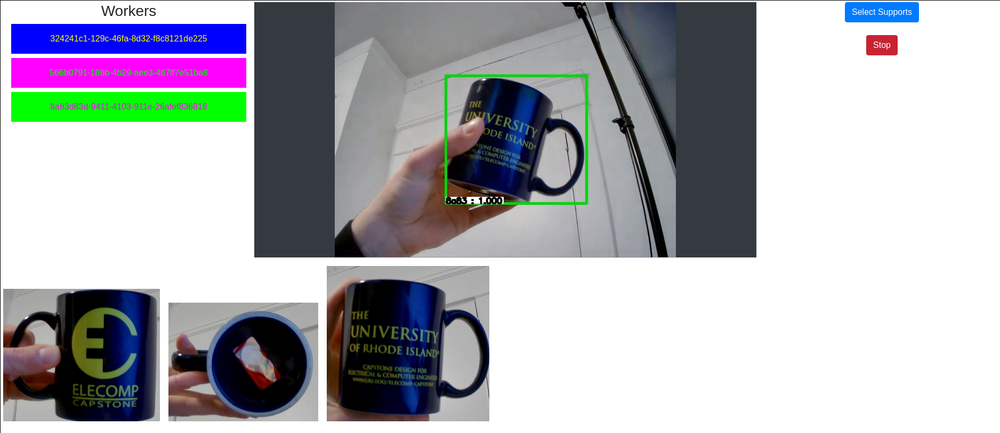

A proof of concept for a distributed object tracking system I made for a networking class. This project uses several instances of an object tracking algorithm, with each instance working with a different support image, with each support image being an cropped image of the object being tracked.  These supports can come from different objects to allow simultaenous tracking of different objects at once or from the same object to enhance tracking performance.  

---

### Requirements

- Docker
- Docker Compose

To create workers use the [worker application](https://github.com/travis575757/distributed_object_tracker_worker).

---

### Usage

1. Add your email address and url to the docker-compose.yml
2. Open ports 80, 443, 5556 and 5557 on the host machine for tcp traffic
3. Start the server with `sudo docker-compose up`
4. Startup [worker](https://github.com/travis575757/distributed_object_tracker_worker) devices, connecion messages should appear in the terminal of the server
5. go to your url you defined in step 1 to use the tracker.
